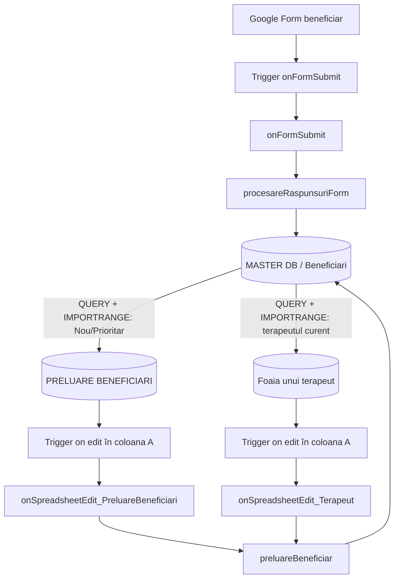

# Documentație AppScript și fluxuri de business

## 1. Scop și surse analizate

Acest document explică proiectul Google Apps Script din acest repository, rolul fiecărui fișier, relația cu obiectele de configurare `CFG` și `CFG_TERAPEUT`, precum și fluxurile de business observate în cod și în exporturile foilor de calcul.

Au fost analizate integral:

- `.clasp.json`
- `appsscript.json`
- `CFG.js`
- `Code.js`
- `PreluareBeneficiari.js`
- `Terapeuti.js`
- `LibGW_imports.js`
- `Transfer.js`
- `MASTER DB.xlsx`
- `PRELUAREBENEFICIARI.xlsx`
- `TERAPEUT_Ovidiu Talpoș (0723166985).xlsx`

Fișierele XLSX sunt exporturi ale foilor Google Sheets și reprezintă un instantaneu local. Formulele exportate confirmă legăturile dintre foi, dar această analiză nu verifică starea curentă a triggerelor sau execuțiile din Google Apps Script.

## 2. Arhitectura funcțională

`MASTER DB / Beneficiari` este sursa centrală de adevăr. Celelalte două tipuri de foi afișează automat subseturi din MASTER prin formule Google Sheets și trimit înapoi modificări prin Apps Script.

### 2.1 Actorii sistemului

| Actor | Rol | Comunică prin |
|---|---|---|
| Beneficiar | Completează formularul de înscriere. | Google Forms. |
| Administrator Apps Script | Configurează ID-uri, foi, întrebări și instalează trigger-ele. | Editorul Apps Script, `CFG`, `CFG_TERAPEUT`, `master_setup()`. |
| Google Forms | Colectează răspunsul și emite evenimentul de submit. | Evenimentul `e` transmis către `onFormSubmit(e)`. |
| Runtime Google Apps Script | Execută handlerele instalate. | Triggere form-submit și spreadsheet on-edit. |
| Biblioteca `LibGW` | Oferă operațiile comune de acces, lock, protecție, logare și instalare a triggerelor. | Apeluri `LibGW.*` din toate modulele de business. |
| Google Sheets | Stochează MASTER-ul și recalculează formulele `QUERY`/`IMPORTRANGE`. | Citiri/scrieri Apps Script și formule între spreadsheet-uri. |
| Operator de alocare | Alege un terapeut pentru un beneficiar nou sau prioritar. | Dropdown-ul B și checkbox-ul A din `PRELUARE BENEFICIARI`. |
| Terapeut | Confirmă preluarea sau cere schimbarea stării beneficiarului. | Dropdown-ul B și checkbox-ul A din foaia proprie. |
| Google Drive | Este folosit numai de utilitara din `Transfer.js`. | `LibGW.copyEntityToFolder(...)`. |

Fișierele `.xlsx` din repository nu sunt deschise sau modificate de Apps Script. Ele sunt exporturi locale folosite aici pentru a documenta structura spreadsheet-urilor Google corespondente. Când tabelele următoare spun „XLSX corespondent”, efectul de runtime are loc în Google Sheets, iar fișierul local rămâne neschimbat.

### 2.2 Canalele de comunicare dintre actori

| Expeditor | Destinatar | Mesaj/date transmise | Mecanism |
|---|---|---|---|
| Beneficiar | Google Forms | răspunsurile, emailul și momentul înscrierii | submit formular |
| Google Forms | Apps Script | `e.response` | trigger instalabil form-submit |
| Apps Script | MASTER | beneficiar nou sau modificarea stării unui beneficiar | API Google Sheets prin `LibGW` și `SpreadsheetApp` |
| MASTER | PRELUARE BENEFICIARI | beneficiarii cu status `Nou` sau `Prioritar` | `QUERY(IMPORTRANGE(...))` |
| Operator | Apps Script | terapeutul ales și ID-ul beneficiarului | editarea checkbox-ului din coloana A |
| MASTER | Foaia terapeutului | beneficiarii alocați terapeutului, aflați în stările acceptate | `QUERY(IMPORTRANGE(...))` |
| Terapeut | Apps Script | acțiunea `Preluat`, `Schimb terapeut` sau `Nu-i mai trebe` | editarea checkbox-ului din coloana A |
| Apps Script | Operator/Terapeut | debifarea comenzii și golirea selecției după succes | scriere în foaia din care a pornit editarea |

### 2.3 Matrice completă: actor, funcții și foi pentru fiecare use case

| Use case | Actor/declanșator | Lanțul exact de funcții și fișiere | Spreadsheet-uri și foi | Rezultat/comunicare către actorul următor |
|---|---|---|---|---|
| `UC-SETUP-01` Conectare proiect | Administrator | Nu există funcție de business. `.clasp.json` leagă sursa locală de Apps Script; `appsscript.json` încarcă `LibGW`; `CFG.js` și `Terapeuti.js` declară configurația. | Nu citește și nu scrie foi. Definește ID-urile spreadsheet-urilor care vor fi folosite ulterior. | Proiectul este pregătit pentru publicare și instalarea triggerelor. |
| `UC-SETUP-02` Instalare triggere | Administrator rulează `master_setup()` | `master_setup()` [`Code.js`] → `setup_terapeut()` [`Terapeuti.js`] → `LibGW.registerSpreadsheetOnEditTrigger(...)`; apoi `setupOnFormSubmit()` [`Code.js`] → `LibGW.installOnFormSubmitTrigger(...)`; apoi `setup_preluarebeneficiari()` [`PreluareBeneficiari.js`] → `LibGW.registerSpreadsheetOnEditTrigger(...)`. | MASTER nu este citit/scris. Sunt legate Google Form-ul din `CFG`, spreadsheet-ul corespondent `PRELUAREBENEFICIARI.xlsx` și toate foile terapeuților din `WATCHING`. | Google Forms și editările din cele două tipuri de foi pot trimite evenimente către Apps Script. |
| `UC-SETUP-03` Adăugare terapeut | Administrator | Nu există o funcție unică. Se actualizează sursa listei, `CFG_TERAPEUT.SHEETS.WATCHING` [`Terapeuti.js`], foaia individuală, apoi se rulează `setup_terapeut()` sau `master_setup()`. | MASTER: `Terapeuti`/lista `LISTA_TERAPEUTI`; PRELUARE: `Config`; foaia individuală: `Config!A2` și structura `Beneficiari`. XLSX corespondente: toate trei. | Terapeutul devine selectabil, primește beneficiarii prin formulă și are trigger on-edit. |
| `UC-FORM-01` Primire înscriere | Beneficiarul trimite formularul; Google Forms emite evenimentul | Trigger → `onFormSubmit(e)` [`Code.js`] → `LibGW.buildResponsesMap(...)` → `procesareRaspunsuriForm(...)` [`Code.js`]. | Formularul din `CFG.FORMS.FORM_ID`; încă nu există o scriere separată înainte de `procesareRaspunsuriForm`. | Map-ul răspunsurilor, emailul și timestamp-ul sunt transmise fluxului de validare. |
| `UC-FORM-02` Validare/duplicat | `procesareRaspunsuriForm(...)` continuă după submit | `procesareRaspunsuriForm(...)` [`Code.js`] → `LibGW.normalizePhone(...)` → `LibGW.openSpreadsheetByFileId(...)` → `LibGW.getSheetByNameFromSpreadsheet(...)` → `LibGW.getHeaderKeyToColMap(...)` → `LibGW.findCellByText(...)`. | Citește Google Sheet-ul corespondent `MASTER DB.xlsx`, foaia `Beneficiari`. | Dacă telefonul este găsit, întoarce `Warning` la `onFormSubmit`; dacă nu, continuă cu inserarea. |
| `UC-FORM-03` Inserare în MASTER | Apps Script după validare | `procesareRaspunsuriForm(...)` [`Code.js`] → `LibGW.protectSheetTemporarily(...)` → `Range.setValue(...)`/`LibGW.getUniqueId()` → `LibGW.copyStyleFromCell(...)` → `SpreadsheetApp.flush()` → `LibGW.unprotectSheetTemporarily(...)`. | `MASTER DB.xlsx`: citește `Config`; scrie un rând în `Beneficiari`. PRELUARE și foile terapeuților nu sunt scrise. | MASTER conține beneficiarul cu ID nou, status `Nou`, terapeut gol; motorul de formule îl poate transmite listei de preluare. |
| `UC-FORM-04` Form Responses | Google Forms, numai dacă destinația nativă este configurată | Nicio funcție din repository. Este mecanismul nativ Google Forms → response spreadsheet. | Posibil scrie `MASTER DB.xlsx`/`Form Responses`; codul nu citește această foaie. | Arhivă brută de răspunsuri, independentă de rândul operațional creat în `Beneficiari`. |
| `UC-PRELUARE-01` Afișare cazuri disponibile | Motorul Google Sheets recalculează după schimbarea MASTER | Nicio funcție JavaScript. Formula din `PRELUARE BENEFICIARI/Beneficiari!C1` execută `QUERY(IMPORTRANGE(...))`. | Citește `MASTER DB.xlsx`/`Beneficiari`; afișează rezultatul în `PRELUAREBENEFICIARI.xlsx`/`Beneficiari`, coloanele C:M. | Operatorul vede numai beneficiarii `Nou` și `Prioritar`. |
| `UC-PRELUARE-02` Alocare terapeut | Operatorul selectează B și editează checkbox-ul A | Trigger instalat de `setup_preluarebeneficiari()` [`PreluareBeneficiari.js`] → `onSpreadsheetEdit_PreluareBeneficiari(e)` [`Code.js`] → `LibGW.tryEnterExecutionGate(...)` → `preluareBeneficiar(...)` [`PreluareBeneficiari.js`] → operațiile `LibGW` de deschidere/căutare/protecție → `SpreadsheetApp.flush()`; revenire în handler → golire A/B → eliberare gate. | Citește/scrie `PRELUAREBENEFICIARI.xlsx`/`Beneficiari` A:B și citește ID-ul din C; citește/scrie `MASTER DB.xlsx`/`Beneficiari`, câmpurile `Terapeut` și `Status`. | MASTER devine `In preluare`; formula scoate rândul din PRELUARE și îl face eligibil pentru foaia terapeutului. |
| `UC-PRELUARE-03` Identitatea terapeutului | Operatorul selectează dropdown-ul | Nu există o funcție de transformare. `onSpreadsheetEdit_PreluareBeneficiari(e)` citește valoarea afișată, iar `preluareBeneficiar(...)` o scrie exact. | Lista vine din `PRELUAREBENEFICIARI.xlsx`/`Config` și `LISTA_TERAPEUTI`; destinația este `MASTER DB.xlsx`/`Beneficiari.Terapeut`. | Eticheta `Nume (telefon)` devine cheia de legătură cu `Config!A2` din foaia terapeutului. |
| `UC-TERAPEUT-01` Afișare beneficiari proprii | Motorul Google Sheets recalculează după alocare | Nicio funcție JavaScript. Formula din foaia terapeutului `Beneficiari!C1` execută `QUERY(IMPORTRANGE(...))` și folosește `Config!A2`. | Citește `MASTER DB.xlsx`/`Beneficiari`; afișează în `TERAPEUT_...xlsx`/`Beneficiari`, coloanele C:Q. | Terapeutul vede beneficiarii săi cu status `In preluare`, `Preluat` sau `Incheiat`. |
| `UC-TERAPEUT-02` Confirmare preluare | Terapeutul selectează `Preluat` în B și editează A | Trigger instalat de `setup_terapeut()` [`Terapeuti.js`] → `onSpreadsheetEdit_Terapeut(e)` [`Terapeuti.js`] → `LibGW.tryEnterExecutionGate(...)` → ramura `Preluat` → `preluareBeneficiar(...)` [`PreluareBeneficiari.js`] → `SpreadsheetApp.flush()`; revenire → golire A/B. | Citește/scrie foaia terapeutului `Beneficiari` A:B și citește C/E; scrie `MASTER DB.xlsx`/`Beneficiari.Status = Preluat` și păstrează `Terapeut`. | MASTER confirmă preluarea; formula păstrează beneficiarul vizibil terapeutului. |
| `UC-TERAPEUT-03` Schimb terapeut | Terapeutul selectează `Schimb terapeut` și editează A | Același trigger → `onSpreadsheetEdit_Terapeut(e)` [`Terapeuti.js`] → ramura `SchimbTerapeut` → `preluareBeneficiar(id, null, Prioritar)` [`PreluareBeneficiari.js`]. | Scrie `MASTER DB.xlsx`/`Beneficiari`: `Status = Prioritar`, `Terapeut` gol; curăță A:B în foaia terapeutului. | Beneficiarul dispare de la terapeut și reapare prin formulă în `PRELUAREBENEFICIARI.xlsx`. |
| `UC-TERAPEUT-04` Nu mai dorește serviciul | Terapeutul selectează `Nu-i mai trebe` și editează A | Același trigger → `onSpreadsheetEdit_Terapeut(e)` [`Terapeuti.js`] → ramura `NuiMaiTrebe` → `preluareBeneficiar(id, null, NU_I_MAI_TREBE)` [`PreluareBeneficiari.js`]. | Scrie `MASTER DB.xlsx`/`Beneficiari`: status nou și terapeut gol; curăță A:B în foaia terapeutului. | Beneficiarul nu mai este selectat de formulele PRELUARE sau terapeut. |
| `UC-TERAPEUT-05` Încheiere | Niciun actor nu poate porni acest caz din UI-ul observat | Nu există ramură în `onSpreadsheetEdit_Terapeut(e)` și nu există valoare în `CFG_TERAPEUT...STATUS_NOU`. | `MASTER DB.xlsx` acceptă `Incheiat`, iar foaia terapeutului îl afișează, dar dropdown-ul local nu îl poate trimite. | Flux incomplet: statusul trebuie setat prin alt mecanism, neidentificat în codul și exporturile analizate. |

În tabelele de mai sus, `A:B`, `C:M` și `C:Q` indică poziția observată în exporturile actuale. Handlerele caută majoritatea câmpurilor după textul antetului din `CFG`, astfel încât destinația logică este antetul, chiar dacă ordinea coloanelor se schimbă. Coloana de declanșare rămâne însă fixată numeric la 1.

## 3. Ce face fiecare fișier

### 3.1 `.clasp.json`

Leagă folderul local de proiectul Google Apps Script prin `scriptId`.

- `rootDir` este rădăcina repository-ului.
- extensiile sincronizate sunt `.js`, `.gs`, `.html` și `.json`.
- `filePushOrder` este gol, deci proiectul nu impune local o ordine explicită a fișierelor la push.
- `skipSubdirectories: false` permite includerea subdirectoarelor eligibile.

### 3.2 `appsscript.json`

Este manifestul proiectului Apps Script.

- fus orar: `Europe/Bucharest`;
- runtime: V8;
- logarea excepțiilor: Stackdriver;
- declară biblioteca externă `LibGW`, versiunea 1, sub simbolul global `LibGW`.

Majoritatea operațiilor comune sunt delegate acestei biblioteci: deschiderea foilor, maparea antetelor, instalarea triggerelor, lock-uri, protecții temporare, copierea stilurilor, normalizarea telefonului și logarea.

### 3.3 `CFG.js`

Conține configurația centrală `CFG` pentru formular, MASTER și foaia de preluare.

#### `CFG.SHEETS.MASTER`

- `ID`: ID-ul Google Spreadsheet pentru MASTER DB;
- `BENEFICIARI.NAME`: numele foii `Beneficiari`;
- `BENEFICIARI.HDR`: textele exacte ale antetelor căutate la runtime;
- `BENEFICIARI.STATUS`: valorile canonice ale statusurilor;
- `CONFIG.NAME`: foaia `Config` din MASTER;
- `CONFIG.HDR`: antetele coloanelor de configurare;
- `CONFIG.DROPDOWN_STYLES_ROWS`: rândurile ale căror celule sunt folosite ca model de stil și validare.

Statusurile definite sunt:

| Cheie CFG | Valoare în foaie |
|---|---|
| `NOU` | `Nou` |
| `PRIORITAR` | `Prioritar` |
| `IN_PRELUARE` | `In preluare` |
| `PRELUAT` | `Preluat` |
| `NU_I_MAI_TREBE` | `Nu-i mai trebe` |
| `INCHEIAT` | `Incheiat` |
| `EROARE_APPSCRIPT` | `Eroare AppScript` |

Exportul MASTER confirmă următoarele liste denumite:

- `STATUS_BENEFICIARI = Config!A2:A21`;
- `PRIORITATI_PRELUARE = Config!C2:C21`;
- `LISTA_TERAPEUTI = Terapeuti!A2:A50`.

În `Terapeuti!A`, eticheta terapeutului este construită ca `Nume (telefon)`. Coloana de email există separat în foaia `Terapeuti`.

#### `CFG.SHEETS.PRELUARE_BENEFICIARI`

- `ID`: ID-ul spreadsheet-ului de preluare;
- `ONEDIT_WATCHEDCELL_COL: 1`: handlerul urmărește coloana A;
- `BENEFICIARI.NAME`: numele foii `Beneficiari`;
- `BENEFICIARI.HDR`: antetele folosite pentru a găsi checkbox-ul, terapeutul și ID-ul beneficiarului.

#### `CFG.FORMS`

- `FORM_ID`: formularul pentru care se instalează triggerul;
- `FORM_RESPONSES_HDR`: titlurile exacte ale întrebărilor din formular.

Titlurile întrebărilor sunt chei de acces în map-ul răspunsurilor. Orice schimbare de text în Google Form trebuie sincronizată cu aceste valori.

#### `getCFG()`

Funcția returnează `CFG_TERAPEUT`, nu `CFG`. Codul local nu o apelează direct. Dacă `LibGW` sau alt consumator o folosește prin convenție, acesta va primi numai configurația foilor terapeuților.

### 3.4 `Code.js`

Conține setup-ul general, fluxul formularului și handlerul foii de preluare.

| Funcție | Rol |
|---|---|
| `master_setup()` | Apelează toate cele trei proceduri de instalare a triggerelor. |
| `setupOnFormSubmit()` | Instalează sau reinstalează triggerul formularului. |
| `onFormSubmit(e)` | Primește evenimentul formularului și construiește map-ul răspunsurilor. |
| `procesareRaspunsuriForm(...)` | Validează, verifică duplicatele și adaugă beneficiarul în MASTER. |
| `test_OnFormSubmit()` | Creează un eveniment mock și rulează fluxul real de inserare în MASTER. |
| `test_OnSpreadsheetEdit()` | Deschide foaia de preluare și testează doar protejarea/deprotejarea ei. |
| `onSpreadsheetEdit_PreluareBeneficiari(e)` | Procesează editarea coloanei A din foaia de preluare. |

### 3.5 `PreluareBeneficiari.js`

Conține instalarea triggerului foii de preluare și funcția comună care modifică MASTER.

| Funcție | Rol |
|---|---|
| `setup_preluarebeneficiari()` | Instalează triggerul on-edit pentru spreadsheet-ul din `CFG.SHEETS.PRELUARE_BENEFICIARI.ID`. |
| `test_preluareBeneficiar()` | Rulează un update real, cu ID și terapeut hardcodate. |
| `preluareBeneficiar(id, email_terapeut, status)` | Găsește beneficiarul după ID și scrie terapeutul și statusul în MASTER. |

Parametrul `email_terapeut` are un nume înșelător. În fluxul de preluare i se transmite textul din dropdown, iar exporturile arată că acesta este o etichetă de forma `Nume (telefon)`, nu adresa de email.

`preluareBeneficiar` este folosită atât la alocarea inițială, cât și la actualizările făcute din foile terapeuților.

### 3.6 `Terapeuti.js`

Conține configurația și handlerul pentru foile individuale ale terapeuților.

#### `CFG_TERAPEUT`

- `SHEETS.WATCHING`: lista ID-urilor foilor individuale urmărite;
- `ONEDIT_WATCHEDCELL_COL: 1`: coloana A este coloana de acțiune `Update`;
- `BENEFICIARI.NAME`: foaia urmărită este `Beneficiari`;
- `BENEFICIARI.HDR`: antetele necesare handlerului;
- `CONFIG.STATUS_NOU`: cele trei acțiuni acceptate din dropdown.

#### Funcții

| Funcție | Rol |
|---|---|
| `setup_terapeut()` | Instalează un trigger on-edit pentru fiecare ID din `WATCHING`. |
| `test_OnSpreadsheetEdit()` | Simulează un edit pentru prima foaie din `WATCHING`. |
| `onSpreadsheetEdit_Terapeut(e)` | Transformă selecția `Status nou` într-un update al beneficiarului din MASTER. |

### 3.7 `LibGW_imports.js`

Definește local constantele de interoperabilitate:

- `LibRetCodeType`: `Succes`, `Warning`, `Eroare`;
- `LibLogType`: `log`, `warning`, `error`.

Valorile sunt comparate cu rezultatele întoarse de biblioteca `LibGW`.

### 3.8 `Transfer.js`

Conține numai `test_cloneFolder()`. Funcția copiază în Drive o entitate identificată printr-un ID sursă într-un folder destinație, folosind `LibGW.copyEntityToFolder`.

Nu este apelată din fluxurile beneficiarilor, preluării sau terapeuților. Este o utilitară de test și produce o copie reală în Drive când este rulată.

## 4. Setup-ul inițial al proiectului

### UC-SETUP-01: conectarea surselor locale la Apps Script

1. `.clasp.json` identifică proiectul Apps Script.
2. `appsscript.json` încarcă runtime-ul V8 și biblioteca `LibGW`.
3. `CFG.js` indică formularul, MASTER-ul și spreadsheet-ul de preluare.
4. `Terapeuti.js` enumeră foile individuale care trebuie urmărite.

### UC-SETUP-02: instalarea triggerelor

Administratorul rulează manual `master_setup()`.

Ordinea apelurilor este:

1. `setup_terapeut()` instalează triggerul `onSpreadsheetEdit_Terapeut` pentru fiecare foaie din `CFG_TERAPEUT.SHEETS.WATCHING`;
2. `setupOnFormSubmit()` instalează triggerul `onFormSubmit` pe formularul din `CFG.FORMS.FORM_ID` și cere reinstalarea celui existent;
3. `setup_preluarebeneficiari()` instalează triggerul `onSpreadsheetEdit_PreluareBeneficiari` pe foaia de preluare.

`master_setup()` nu agregă și nu returnează rezultatele celor trei operații. Reușita trebuie verificată din logurile Apps Script și din lista de trigger-e instalate.

### UC-SETUP-03: adăugarea unui terapeut nou

Din structura actuală rezultă că trebuie sincronizate mai multe locuri:

1. terapeutul se adaugă în sursa listei de terapeuți;
2. eticheta lui trebuie să coincidă cu valoarea folosită în MASTER și cu `Config!A2` din foaia individuală;
3. se creează sau se configurează foaia individuală cu structura și formulele așteptate;
4. ID-ul foii se adaugă în `CFG_TERAPEUT.SHEETS.WATCHING`;
5. se rulează din nou setup-ul triggerelor.

Exportul foii de preluare arată că lista dropdown este importată în `Config!A2:A1000` dintr-un alt spreadsheet și este expusă prin numele `LISTA_TERAPEUTI`. Codul JavaScript nu administrează această listă.

## 5. Fluxul de înscriere din formular

### UC-FORM-01: beneficiarul completează formularul

1. Google Forms emite evenimentul de submit.
2. Triggerul instalat cheamă `onFormSubmit(e)`.
3. Handlerul cere un eveniment cu `e.response`.
4. `LibGW.buildResponsesMap(e.response)` construiește un obiect indexat după titlul fiecărei întrebări.
5. Handlerul transmite map-ul, emailul respondentului și timestamp-ul către `procesareRaspunsuriForm`.

### UC-FORM-02: validarea și detectarea unui posibil duplicat

`procesareRaspunsuriForm`:

1. respinge un map lipsă, invalid sau gol;
2. scrie toate răspunsurile în log;
3. citește telefonul folosind cheia `CFG.FORMS.FORM_RESPONSES_HDR.NUMAR_DE_TELEFON`;
4. normalizează telefonul cu prefixul `40` pentru căutare;
5. deschide MASTER-ul din `CFG.SHEETS.MASTER.ID`;
6. deschide foaia `CFG.SHEETS.MASTER.BENEFICIARI.NAME`;
7. construiește map-ul antet → număr de coloană;
8. caută telefonul și, dacă îl găsește, încheie cu `Warning` fără să adauge un rând.

Observație de implementare: este verificată existența coloanei `Telefon`, dar apelul `findCellByText` caută în intervalul de rânduri al întregii foi, fără să primească explicit coloana telefonului. În plus, căutarea folosește telefonul normalizat, iar valoarea scrisă ulterior în MASTER este textul original din formular.

### UC-FORM-03: adăugarea beneficiarului în MASTER

Dacă nu este găsit un duplicat:

1. foaia `Beneficiari` este protejată temporar prin `LibGW.protectSheetTemporarily`;
2. se alege primul rând liber;
3. coloanele sunt descoperite din antete, folosind `CFG.SHEETS.MASTER.BENEFICIARI.HDR`;
4. răspunsurile sunt copiate în coloanele MASTER;
5. data înscrierii este formatată `dd.MM.yyyy HH:mm:ss` în fusul orar al scriptului;
6. rândul este formatat cu font Arial, mărime 12 și aliniere centrală;
7. ID-ul este generat ca `B_` + `LibGW.getUniqueId()`;
8. stilul și validarea pentru `Status` sunt copiate din `Config`, rândul configurat prin `DROPDOWN_STYLES_ROWS.STATUS_BENEFICIARI`;
9. statusul este setat la `CFG.SHEETS.MASTER.BENEFICIARI.STATUS.NOU`;
10. stilul și validarea pentru `Terapeut` sunt copiate din celula configurată prin `DROPDOWN_STYLES_ROWS.DROPDOWN_TERAPEUTI`;
11. terapeutul este lăsat gol;
12. schimbările sunt trimise cu `SpreadsheetApp.flush()`;
13. protecția temporară este eliminată în `finally`.

Maparea principală este:

| Sursa din formular | Destinația în MASTER |
|---|---|
| emailul respondentului | `Email` |
| numele și prenumele | `Nume` |
| numărul de telefon | `Telefon` |
| vârsta | `Varsta` |
| genul | `Genul` |
| preferința pentru ședințe | `Tip sedinte` |
| localitatea | `In afara Clujului` |
| motivul solicitării | `Descriere motiv` |
| intervalele disponibile | `Intervale program` |
| categoria de donație | `Donatie` |
| diagnosticul/tratamentul | `Diagnostic` |
| sursa informării | `De unde ati auzit de noi` |
| alte informații | `Alte informații` |
| timestamp-ul evenimentului | `Data inscriere` |

### UC-FORM-04: rolul foii `Form Responses`

Exportul MASTER conține o foaie `Form Responses`, însă codul analizat nu o citește și nu o scrie.

Fluxul implementat de Apps Script este:

`eveniment Google Form → onFormSubmit → procesareRaspunsuriForm → MASTER/Beneficiari`.

Dacă Google Form este configurat separat să salveze automat răspunsurile într-un spreadsheet, aceasta este o funcție nativă Google Forms și poate popula `Form Responses` independent. Pentru logica din acest repository, rândul operațional din `Beneficiari` este creat de script.

## 6. Fluxul de preluare a unui beneficiar

### UC-PRELUARE-01: popularea automată a listei de preluare

În `PRELUAREBENEFICIARI.xlsx`, foaia `Beneficiari` conține o formulă `QUERY(IMPORTRANGE(...))` care citește din `MASTER/Beneficiari` și afișează numai rândurile cu:

- `Status = Nou`; sau
- `Status = Prioritar`.

Rezultatele sunt ordonate descrescător după status. Coloanele C:M vin din MASTER. Coloanele A și B sunt coloane locale de lucru:

- A: `Preia beneficiar`, checkbox;
- B: `Terapeut`, dropdown bazat pe `LISTA_TERAPEUTI`.

Apps Script nu copiază beneficiarii în această foaie. Formula îi afișează automat.

### UC-PRELUARE-02: operatorul alege terapeutul și bifează preluarea

Fluxul normal de utilizare este:

1. operatorul alege un terapeut în coloana B;
2. operatorul bifează coloana A pe același rând;
3. triggerul on-edit cheamă `onSpreadsheetEdit_PreluareBeneficiari(e)`;
4. handlerul acceptă numai editări de o singură celulă, în spreadsheet-ul configurat, foaia `Beneficiari`, coloana A;
5. `LibGW.tryEnterExecutionGate` blochează execuțiile concurente pentru aceeași foaie;
6. handlerul citește `ID` și `Terapeut` din rând;
7. apelează `preluareBeneficiar(ID, terapeut, "In preluare")`;
8. funcția comună găsește ID-ul în MASTER, protejează temporar foaia și scrie:
   - `Terapeut = valoarea selectată în dropdown`;
   - `Status = In preluare`;
9. la succes, handlerul debifează coloana A și golește selecția locală din B;
10. statusul nu mai este `Nou/Prioritar`, deci formula elimină automat rândul din lista de preluare;
11. execution gate-ul și protecția temporară sunt eliberate în `finally`.

### UC-PRELUARE-03: ce reprezintă terapeutul selectat

În implementarea și exporturile actuale, dropdown-ul conține etichete de forma `Nume (telefon)`. Codul scrie această etichetă în coloana `Terapeut` din MASTER.

Adresele de email sunt păstrate separat în `MASTER/Terapeuti`, însă nu sunt valoarea folosită de acest flux. Numele parametrului `email_terapeut` din `preluareBeneficiar` nu reflectă valoarea transmisă efectiv.

## 7. Fluxurile din foaia individuală a terapeutului

### UC-TERAPEUT-01: afișarea beneficiarilor terapeutului

Exportul foii individuale arată o formulă `QUERY(IMPORTRANGE(...))` care compară:

- `MASTER/Beneficiari.Terapeut` cu `Config!A2` din foaia terapeutului;
- statusul cu `In preluare`, `Preluat` sau `Incheiat`.

Astfel, beneficiarul apare automat în foaia terapeutului după alocare. Apps Script nu face o copie fizică a rândului în foaia terapeutului.

Coloanele C:Q provin din MASTER. Coloanele locale de comandă sunt:

- A: `Update`, checkbox;
- B: `Status nou`, dropdown.

Lista dropdown confirmată în export conține:

- `Preluat`;
- `Schimb terapeut`;
- `Nu-i mai trebe`.

### UC-TERAPEUT-02: terapeutul confirmă preluarea

1. terapeutul selectează `Preluat` în coloana B;
2. bifează `Update` în coloana A;
3. triggerul cheamă `onSpreadsheetEdit_Terapeut(e)`;
4. handlerul verifică spreadsheet-ul, foaia, editarea unei singure celule și coloana A;
5. intră în execution gate;
6. mapează acțiunea la `CFG.SHEETS.MASTER.BENEFICIARI.STATUS.PRELUAT`;
7. preia terapeutul curent din coloana E;
8. `preluareBeneficiar` păstrează terapeutul și schimbă statusul MASTER în `Preluat`;
9. la succes, checkbox-ul este debifat și `Status nou` este golit.

### UC-TERAPEUT-03: beneficiarul solicită schimbarea terapeutului

Pentru `Schimb terapeut`, handlerul trimite:

- `Status = Prioritar`;
- `Terapeut = null`.

Efectul așteptat în MASTER este golirea terapeutului și revenirea beneficiarului cu prioritate în `PRELUARE BENEFICIARI`, deoarece formula de acolo include statusul `Prioritar`.

### UC-TERAPEUT-04: beneficiarul nu mai dorește serviciul

Pentru `Nu-i mai trebe`, handlerul trimite:

- `Status = Nu-i mai trebe`;
- `Terapeut = null`.

Beneficiarul nu mai corespunde nici filtrului foii terapeutului, nici filtrului foii de preluare.

### UC-TERAPEUT-05: beneficiar încheiat

Statusul `Incheiat` există în `CFG` și formula foii terapeutului îl afișează, dar nu există o opțiune `Incheiat` în `CFG_TERAPEUT.SHEETS.CONFIG.STATUS_NOU` sau în lista dropdown observată. În codul actual, terapeutul nu poate seta acest status prin handlerul descris mai sus.

## 8. Relația dintre CFG, antete și formule

| Element | Configurație folosită de script | Dependență în foi |
|---|---|---|
| MASTER | `CFG.SHEETS.MASTER.ID` | Toate formulele `IMPORTRANGE` trebuie să indice același MASTER. |
| Foaia beneficiarilor | `CFG.SHEETS.MASTER.BENEFICIARI.NAME` | Formulele folosesc intervalul `Beneficiari!A:Q`. |
| Antete MASTER | `CFG...BENEFICIARI.HDR` | Textul din rândul 1 trebuie să coincidă exact. |
| Statusuri | `CFG...BENEFICIARI.STATUS` | Formulele folosesc literal valorile `Nou`, `Prioritar`, `In preluare`, `Preluat`, `Incheiat`. |
| Stil status | `CFG...DROPDOWN_STYLES_ROWS.STATUS_BENEFICIARI` | Celula model din `Config` trebuie să păstreze validarea și stilul. |
| Stil terapeut | `CFG...DROPDOWN_STYLES_ROWS.DROPDOWN_TERAPEUTI` | Celula model trebuie să folosească lista corectă de terapeuți. |
| Formular | `CFG.FORMS.FORM_ID` | Triggerul se instalează pe acest formular. |
| Întrebări formular | `CFG.FORMS.FORM_RESPONSES_HDR` | Titlurile din formular sunt chei și trebuie să coincidă exact. |
| Foaia de preluare | `CFG.SHEETS.PRELUARE_BENEFICIARI.ID` | Triggerul și filtrul handlerului verifică acest ID. |
| Acțiune preluare | `ONEDIT_WATCHEDCELL_COL = 1` | Coloana A trebuie să rămână `Preia beneficiar`. |
| Foi terapeuți | `CFG_TERAPEUT.SHEETS.WATCHING` | Numai aceste spreadsheet-uri sunt acceptate de handler. |
| Acțiune terapeut | `CFG_TERAPEUT...ONEDIT_WATCHEDCELL_COL = 1` | Coloana A trebuie să rămână `Update`. |
| Acțiuni terapeut | `CFG_TERAPEUT...STATUS_NOU` | Valorile dropdown trebuie să coincidă exact cu cele din `switch`. |

Configurația este dublată în două forme:

1. JavaScript (`CFG` și `CFG_TERAPEUT`) controlează ID-urile, antetele și valorile scrise;
2. formulele și listele denumite din Google Sheets controlează ce rânduri sunt afișate și ce opțiuni apar în dropdown-uri.

O modificare de nume, status, antet sau identificator de terapeut trebuie sincronizată în ambele locuri.

## 9. Protecție, concurență și logare

### Protecție temporară

Scrierile în MASTER și modificările locale sunt încadrate de:

- `LibGW.protectSheetTemporarily(...)`;
- `LibGW.unprotectSheetTemporarily(...)` în `finally`.

Opțiunile folosesc așteptare de 5 secunde și maximum 30 de secunde.

### Execution gate

Cele două handlere on-edit folosesc `LibGW.tryEnterExecutionGate("ONEDIT_GATE", [spreadsheetId, sheetId], 0)`. Scopul este evitarea procesării simultane sau reentrante pentru aceeași foaie. Gate-ul este eliberat în `finally`.

### Logare

Codul folosește `LibGW.Log` pentru succes, warning și eroare. În fluxul formularului sunt logate răspunsurile complete, inclusiv date personale și informații despre sănătate.

## 10. Cazuri de eroare și limitele implementării actuale

### 10.1 Checkbox-ul nu este validat ca fiind bifat

Ambele handlere on-edit verifică numai faptul că editarea s-a produs în coloana A. Valorile `oldValue`, `newValue` și `newDisplayValue` sunt logate, dar nu sunt folosite pentru a cere explicit `TRUE`.

Prin urmare, orice editare a unei celule din coloana A poate porni procesarea, inclusiv o debifare sau o valoare introdusă manual.

### 10.2 Regulile de preluare documentate în comentarii sunt dezactivate

Comentariul funcției `preluareBeneficiar` spune că beneficiarul poate fi preluat numai dacă statusul este `Nou/Prioritar` și terapeutul este gol. Verificările respective există în cod, dar sunt comentate.

În forma actuală, orice beneficiar găsit după ID poate avea câmpurile `Terapeut` și `Status` suprascrise cu argumentele primite.

### 10.3 Nu există validare activă pentru terapeutul selectat

Validarea argumentului numit `email_terapeut` este comentată. Handlerul de preluare poate trimite un text gol dacă checkbox-ul este bifat înainte de selectarea terapeutului.

### 10.4 Inserarea din formular nu este tranzacțională

Rândul este creat și completat înainte de toate operațiile de copiere a stilului. Dacă apare o eroare după scrierile inițiale, nu există rollback sau ștergere a rândului parțial.

Statusul `Eroare AppScript` este definit în `CFG`, dar nu este atribuit în niciun flux analizat.

### 10.5 Ramurile de eroare conțin identificatori problematici

În `procesareRaspunsuriForm`, ramurile de eroare de la copierea stilului folosesc `Log(...)` fără prefixul `LibGW` și încearcă să citească `retGetSheetFormular`, care nu este definit în funcție. Aceste ramuri pot masca eroarea inițială cu o nouă excepție.

Alte blocuri `catch` folosesc de asemenea `Log(...)` fără prefix în loc de `LibGW.Log(...)`.

### 10.6 Există două funcții globale `test_OnSpreadsheetEdit`

Numele este declarat atât în `Code.js`, cât și în `Terapeuti.js`. În Apps Script toate fișierele aceluiași proiect împart spațiul global, deci numele duplicat face ambiguă funcția de test disponibilă în editor.

### 10.7 Configurația pentru terapeuți nu este unificată

`getCFG()` returnează `CFG_TERAPEUT`, în timp ce fluxurile principale citesc direct `CFG`. Nu există o singură funcție care să expună explicit ambele configurații.

### 10.8 Formulele sunt dependente de aceleași texte ca scriptul

Formulele din foi conțin statusurile ca texte literale. Dacă valoarea din `CFG` se schimbă fără actualizarea formulelor, beneficiarii pot dispărea din listele operaționale sau pot rămâne în lista greșită.

## 11. Funcții de test și efectele lor reale

Funcțiile denumite `test_*` nu sunt teste izolate și pot modifica date sau Drive:

| Funcție | Efect |
|---|---|
| `test_OnFormSubmit()` din `Code.js` | Apelează fluxul real și poate adăuga un beneficiar în MASTER. Nu instalează triggerul, în ciuda comentariului. |
| `test_OnSpreadsheetEdit()` din `Code.js` | Protejează și deprotejează foaia de preluare. |
| `test_preluareBeneficiar()` | Modifică terapeutul și statusul unui ID hardcodat din MASTER. |
| `test_OnSpreadsheetEdit()` din `Terapeuti.js` | Încearcă să simuleze un edit pe prima foaie de terapeut. |
| `test_cloneFolder()` | Creează o copie reală a unei entități Drive în folderul destinație. |

## 12. Rezumatul fluxului complet

1. Administratorul configurează ID-urile, antetele, statusurile, listele și foile terapeuților.
2. Administratorul rulează `master_setup()` pentru instalarea triggerelor.
3. Beneficiarul trimite formularul.
4. Apps Script transformă răspunsurile și creează un rând `Nou` în `MASTER/Beneficiari`.
5. Formula din `PRELUARE BENEFICIARI` afișează automat beneficiarul.
6. Operatorul selectează terapeutul și bifează `Preia beneficiar`.
7. Apps Script scrie terapeutul și statusul `In preluare` în MASTER.
8. Beneficiarul dispare din lista de preluare și apare automat în foaia terapeutului.
9. Terapeutul selectează o acțiune și bifează `Update`.
10. Apps Script actualizează MASTER:
    - `Preluat`: păstrează terapeutul;
    - `Schimb terapeut`: golește terapeutul și setează `Prioritar`;
    - `Nu-i mai trebe`: golește terapeutul și închide fluxul operațional pentru acel beneficiar.
11. Formulele din foi reflectă automat noua stare din MASTER.
